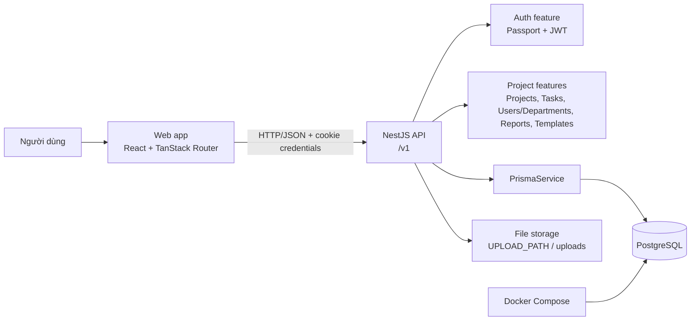

# Kiến trúc Open Project

## 1. Phạm vi và mục tiêu

Open Project là ứng dụng quản lý dự án, gồm giao diện web, API máy chủ và cơ sở dữ liệu quan hệ. Mã nguồn tổ chức trong một monorepo dùng pnpm và Turborepo. Hai ứng dụng chính là:

- `apps/web`: giao diện React chạy trên Vite/TanStack Start, điều hướng bằng TanStack Router.
- `apps/api`: API NestJS, tổ chức theo feature và truy cập dữ liệu qua Prisma.
- `apps/api/prisma`: schema, migration và seed cho PostgreSQL.
- `packages/*`: cấu hình dùng chung, hiện gồm TypeScript và oxfmt.

## 2. Sơ đồ tổng thể

Web và API là hai tiến trình độc lập trong môi trường phát triển. PostgreSQL chạy qua Docker Compose, mặc định được expose tại `127.0.0.1:5433`. Redis có cấu hình mẫu nhưng hiện đang tắt.

## 3. Backend API

`apps/api/src/main.ts` khởi tạo NestJS và cấu hình các concern dùng chung:

- URI versioning với phiên bản mặc định `v1`.
- CORS có credentials để hỗ trợ cookie.
- `cookie-parser` và compression.
- `ValidationPipe` với `transform`, `whitelist` và `forbidNonWhitelisted` để chuẩn hóa, giới hạn input DTO và từ chối field không được khai báo.
- Global exception filter, response transform interceptor và `ClassSerializerInterceptor`.
- Static assets tại `/uploads`, lấy đường dẫn từ `UPLOAD_PATH` hoặc thư mục `uploads`.
- Swagger chỉ bật ngoài production.

`AppModule` ghép các module nền tảng và nghiệp vụ. `PrismaModule` là global module, cung cấp `PrismaService` cho các feature. Các feature hiện có:

- `auth`: đăng nhập, JWT, Passport local/JWT strategy.
- `projects`: quản lý dự án và thành viên dự án.
- `tasks`: task, quan hệ cha-con, người phụ trách, dependency và lịch sử liên quan.
- `users-departments`: người dùng và phòng ban.
- `notifications`: thông báo người dùng.
- `reports`: báo cáo.
- `templates`: mẫu dự án và task.
- `health`: health check.

Mỗi feature giữ controller, service, DTO và thành phần liên quan trong thư mục riêng. Controller xử lý HTTP và validation; service chứa nghiệp vụ; Prisma là ranh giới truy cập DB. Các guard JWT và roles được đăng ký ở cấp ứng dụng qua `APP_GUARD`, vì vậy endpoint riêng tư cần vượt qua xác thực và phân quyền tương ứng. Endpoint công khai dùng decorator `@Public()`.

## 4. Frontend Web

`apps/web` dùng React 19, Vite, TanStack Start và TanStack Router. `src/router.tsx` tạo router từ `routeTree.gen.ts`; `src/routes/__root.tsx` cung cấp HTML shell, stylesheet, font IBM Plex Sans, `Outlet` và scripts. Route hiện được sinh từ `src/routes`, với trang gốc tại `index.tsx`.

Các thành phần UI dùng Base UI, React Aria Components và Tailwind CSS v4. `src/api/endpoints` chứa lớp gọi API theo endpoint; `src/api/client.ts` là điểm mở rộng cho cấu hình HTTP client và xử lý credentials. Web không truy cập DB trực tiếp, chỉ giao tiếp với API.

## 5. Mô hình dữ liệu

PostgreSQL là nguồn dữ liệu chính. Prisma schema mô hình hóa các thực thể cốt lõi:

- `User`, `Department`, `Project`, `ProjectMember`.
- `Task`, `TaskAssignee`, `TaskDependency`, `Milestone`.
- `Template`, `TemplateTask`, `TaskHistory`, `CustomField`, `TaskCustomField`.
- Các thực thể cộng tác như comment, attachment và notification.
- Enum cho role, trạng thái dự án/task, độ ưu tiên và loại dependency.

Quan hệ chính: một project có nhiều task, milestone, member và template; task có thể có subtask, assignee, dependency, comment, attachment, custom field và history. Soft delete được thể hiện bằng `deletedAt` ở nhiều bảng. Thay đổi schema phải đi qua Prisma migration trong `apps/api/prisma/migrations`.

## 6. Luồng request điển hình

1. Người dùng thao tác trên Web route hoặc feature UI.
2. Web gọi API qua HTTP `/v1`, gửi cookie credentials khi cần.
3. NestJS áp dụng versioning, global pipe, JWT guard và roles guard.
4. Controller chuyển input đã validate cho service của feature.
5. Service thực hiện nghiệp vụ qua `PrismaService`.
6. API trả response qua transform interceptor; lỗi đi qua global exception filter.
7. Web cập nhật trạng thái UI và điều hướng bằng TanStack Router.

## 7. Cấu hình và vận hành

Cấu hình API tải từ biến môi trường qua `ConfigModule` và các config factory trong `apps/api/src/configs`. Database development chạy bằng `docker/compose.dev.yml`. Các lệnh Turborepo ở root chuyển tiếp `build`, `dev`, `lint`, `format` và `check-types` đến workspace phù hợp. Build tạo output `dist/**` hoặc `.output/**` theo ứng dụng.

Ranh giới mở rộng ưu tiên: thêm nghiệp vụ vào feature tương ứng, thêm model và migration qua Prisma, thêm endpoint client trong `apps/web/src/api/endpoints`, rồi thêm route/UI ở Web. Không đưa logic nghiệp vụ vào route component hoặc controller khi logic có thể dùng lại ở service.
